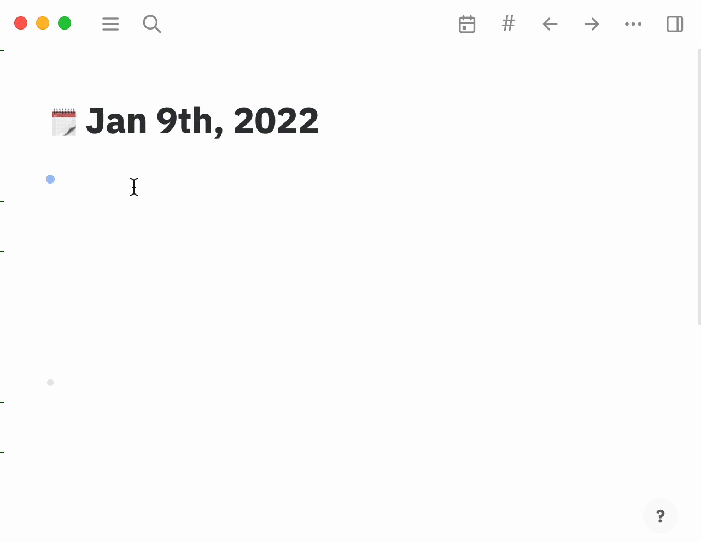

# logseq-plugin-image-uploader

# Usage

## Installation

- Download the latest [release](https://github.com/JJAYCHEN1e/logseq-plugin-image-uploader/releases) of the plugin.
- Open Logseq Desktop client and turn on Developer Mode in the user settings panel
- Open the toolbar dot menus and navigate to the plugins page
- Read the README file
- Navigate to the plugins dashboard: `t` `p`
- Click the Load unpacked plugin button, then select the sample directory to load it

> Note: You can't use the plugin downloaded from marketplace due to CORS restriction. Please load it manually.

## Configuration

Currently, we only support turning off auto uploading feature in the configuration file.

```json
{
  "disabled": false,
  "autoUploading": true
}
```

## How to use it?

Currently, we only support [PicGo](https://github.com/Molunerfinn/PicGo), so please open PicGo manually.

By default, when you paste any content into a block, after exit editing that block, the plugin will check whether its content contains any images, if it does, the plugin will upload them and replace them with remote URLs. You can turn off this feature in the configuration file.



Alternatively, if you have inserted any images before, you can right-click any block' dot to show its context menu, and select `Upload image`. All images detected in that block will be uploaded, and replaced with remote URLs. 


### Note

Since we don't have any permission to operate the file system in a logseq plugin, we can't delete the original file saved by logseq. So we create a page named **"Uploaded image file record(created by logseq-plugin-image-uploader)"** to save all the images we uploaded. You can delete them manually. (One image path actually can appear more than once on that page, for example, you use that image many times, and you upload them more than once)

We may provide a script to delete those images in the future.

# Development

Logseq plugins API: https://logseq.github.io/plugins/

## Build

- Install the latest stable distribution of [Node.js](https://nodejs.org/).
- Install [pnpm](https://pnpm.io/installation).
- Run `pnpm install` 
- Run `pnpm build`

## Debug

You can open developer tools in Logseq Desktop client's menu bar: `View` -> `Toggle Developer Tools`(or using keyboard shortcut: `Command + Option + I`).

# FAQ

## Why only PicGo is supported?

Currently, logseq plugins are running in a browser-only sandbox, which means we can't access the file system or execute any local scripts. PicGo provides a local server to upload images by HTTP(s) request, we choose PicGo as a start point. If we want to support more image uploading software, either it provides a similar feature, or we should launch a local server with the Logseq Desktop client.

## I failed to upload with PicGO.

First, make sure PicGo is running, and then check [PicGo server](https://picgo.github.io/PicGo-Doc/en/guide/config.html#picgo-server-setting) is configured to run at port `36677`. We'll provide a setting for the plugin in the future. 

If it keeps failing, please fire a [new issue](https://github.com/JJAYCHEN1e/logseq-plugin-image-uploader/issues/new).
